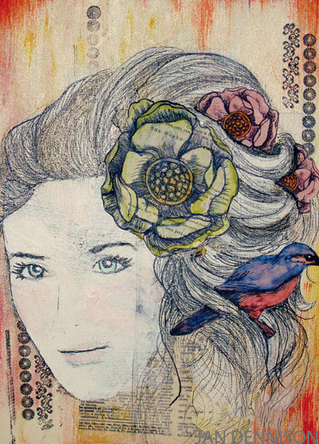
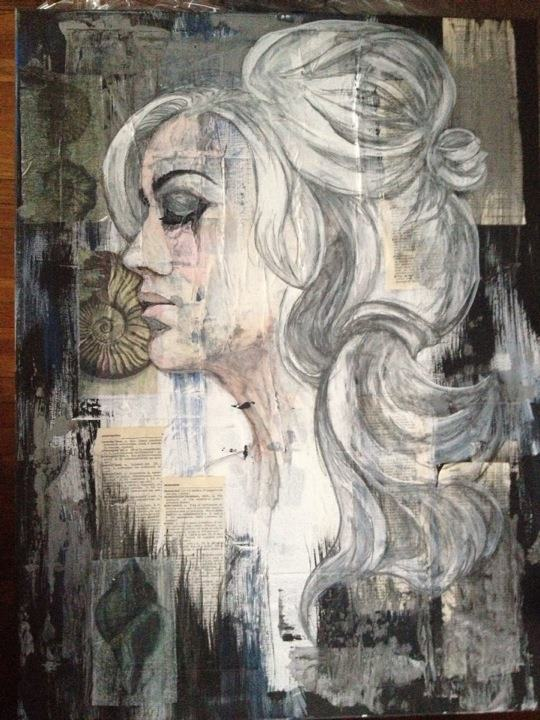

	<ul>
		<li class="frame">
			
		</li>
		<li class="frame">
			
		</li>
		<li class="frame">
			
		</li>
		<li class="frame">
			
		</li>
		<li class="frame">
			
		</li>
		<li class="frame">
			
		</li>
		<li class="frame">
			
		</li>
		<li class="frame">
			
		</li>
		<li class="frame">
			
		</li>
		<li class="frame">
			
		</li>
		<li class="frame">
			
		</li>
		<li class="frame">
			
		</li>
	</ul>

 This work is licensed under a <a rel="license" href="http://creativecommons.org/licenses/by-nc-nd/4.0/">Creative Commons Attribution-NonCommercial-NoDerivatives 4.0 International License</a>.
